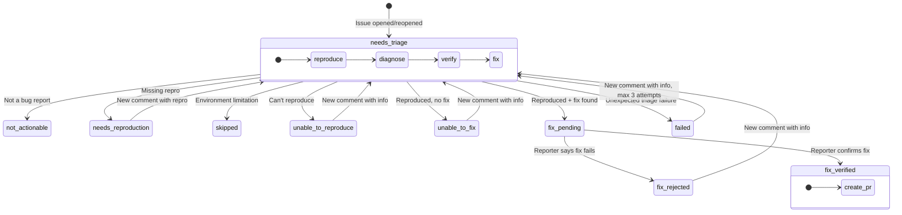

# triagebot-action

AI-powered issue triage bot for GitLab projects. Uses a label-driven state machine to automatically reproduce bugs, diagnose root causes, attempt fixes, and verify them with reporters.

Runs as a GitLab CI job via [`.gitlab-ci.yml`](.gitlab-ci.yml).

> **Using GitHub?** This is a GitLab-only fork. Use upstream
> [withastro/triagebot-action](https://github.com/withastro/triagebot-action) — it is the
> GitHub Action this was forked from, and it is where GitHub support is maintained.

## How it works

When an issue is opened, the bot adds a triage label and runs an AI agent through a multi-stage pipeline: **reproduce** the bug, **diagnose** the root cause, **verify** it's actually a bug, and **attempt a fix**. If a fix is found, it pushes a branch, publishes a preview release, and asks the reporter to confirm. When they do, it opens a merge request.

Repositories that can't publish preview releases (or that prefer to skip the confirmation step) can set `auto-pr-on-fix: true` to open the merge request immediately once a fix is pushed, moving the issue straight to `fix verified`.

The entire flow is driven by a finite state machine encoded as issue labels. Each issue has exactly one triage label at any time, and transitions happen automatically based on events and AI classification.

### State Machine



### Label Reference

| Label | Meaning |
|-------|---------|
| `triage: needs triage` | Waiting for the triage agent to run |
| `triage: not actionable` | Not a bug report (feature request, discussion, etc.) |
| `triage: needs reproduction` | Missing reproduction or expected behavior description |
| `triage: skipped` | Cannot triage in CI (host-specific, unsupported runtime/version) |
| `triage: unable to reproduce` | Agent attempted reproduction but could not reproduce |
| `triage: unable to fix` | Bug reproduced and diagnosed, but no fix found |
| `triage: failed` | Triage failed unexpectedly; can be retried up to 3 failed attempts |
| `triage: fix pending` | Fix pushed to branch, waiting for reporter confirmation |
| `triage: fix rejected` | Reporter says the proposed fix does not work |
| `triage: fix verified` | Reporter confirmed the fix works, merge request created |

All label names are customizable via job inputs.

**Re-triageable labels** — when a new comment arrives on an issue with one of these labels, the bot evaluates whether the comment contains new actionable information and potentially re-runs triage:

- `triage: needs triage`
- `triage: needs reproduction`
- `triage: unable to reproduce`
- `triage: unable to fix`
- `triage: failed`
- `triage: fix rejected`

**Terminal labels** — the bot takes no further action:

- `triage: fix verified`
- `triage: not actionable`
- `triage: skipped`

## Setup

The job builds and runs the bot from its own checkout, so **use a fork or vendored copy of
this repo** — a remote `include:` from your project would resolve `dist/index.mjs` against
your checkout and fail.

### 1. Wire the webhook

GitLab has no issue-event pipeline source, but it does not need an external webhook
receiver either: a project webhook can POST straight at the pipeline trigger endpoint, as
long as the ref is in the URL.

Under **Settings → Webhooks**, add a hook with the **Issues events** and **Comments
events** triggers and this URL:

```
https://gitlab.example.com/api/v4/projects/<id>/ref/main/trigger/pipeline?token=<trigger_token>
```

The ref in the URL takes precedence over the payload, and GitLab exposes the full webhook
body to the job as `$TRIGGER_PAYLOAD` — a *file path*, which is what the bot reads the
event from.

`CI_PIPELINE_SOURCE` is `trigger`, not anything issue-specific, so `rules:` cannot gate on
the event type (the payload is a file, which `rules:` cannot read). Gating happens in-job:
the router skips merge request comments, and the bot resolves its own token username so it
ignores the comments it posts itself.

Requires GitLab 16.11+, for `object_attributes.action` on note hooks.

### 2. Create triage skills

The bot needs project-specific skill files that tell the AI agent how to work with your
codebase. Create these in the directory specified by `triage-skill`:

```
.agents/skills/triage/
  SKILL.md          # Orchestration: defines the step order and early exits
  reproduce.md      # How to reproduce bugs in your project
  diagnose.md       # How to find root causes in your codebase
  verify.md         # How to distinguish bugs from intended behavior
  fix.md            # How to write and verify fixes
```

Each file is a markdown document with instructions for the AI agent. The
[`examples/skills/triage/`](examples/skills/triage/) directory contains starter templates
you can copy and customize. Look for `<!-- CUSTOMIZE -->` comments indicating
project-specific sections.

### 3. Set the CI/CD variables

Inputs are read from the environment as `INPUT_*`, so masked CI/CD variables are all that
is needed — there is no `with:` block to fill in. GitLab variable keys allow only letters,
digits and underscores, so a hyphenated input name maps to its underscored form:
`triage-model` becomes `INPUT_TRIAGE_MODEL`.

| Variable | Notes |
|----------|-------|
| `INPUT_READ_TOKEN` | Project access token, `read_api` + `read_repository` (the fix-branch lookup uses git) |
| `INPUT_WRITE_TOKEN` | Project access token, `api` + `write_repository`. **`CI_JOB_TOKEN` cannot write issues**, so it will not do |
| `INPUT_ANTHROPIC_API_KEY` | Or `INPUT_CLOUDFLARE_API_KEY` + `INPUT_CLOUDFLARE_ACCOUNT_ID` |

The required `triage-skill` input is already set in the job file as
`INPUT_TRIAGE_SKILL: .agents/skills/triage` — change it there if your skills live
elsewhere.

You need credentials for the AI agent. Choose one of:

- **`anthropic-api-key`** — to use Anthropic models (the default `triage-model` /
  `verification-model`).
- **`cloudflare-api-key`** + **`cloudflare-account-id`** — to use Cloudflare Workers AI
  models (e.g. Kimi). Requires setting `triage-model` / `verification-model` to a
  `cloudflare-workers-ai/*` model.

Workers AI is called over its OpenAI-compatible REST endpoint, so the job still runs on a
standard GitLab runner — no Worker deployment is required.

```
INPUT_CLOUDFLARE_API_KEY     = …
INPUT_CLOUDFLARE_ACCOUNT_ID  = …
INPUT_TRIAGE_MODEL           = cloudflare-workers-ai/@cf/moonshotai/kimi-k2.7-code
INPUT_VERIFICATION_MODEL     = cloudflare-workers-ai/@cf/moonshotai/kimi-k2.6
```

### Things GitLab does differently

- **Concurrency is project-wide** (`resource_group`), not per issue. The issue number
  lives inside the payload file, which `resource_group` cannot read.
- **Bot identity is resolved at runtime** via `glab api user`, because a project access
  token posts as `project_<id>_bot_<hash>` — a name nothing can hardcode.
- **Notes carry no author association.** `issueDetails` reports every commenter as
  `NONE`, so skill logic keyed on `MEMBER` / `COLLABORATOR` / `OWNER` never fires.


## Inputs

| Input | Required | Default | Description |
|-------|----------|---------|-------------|
| `read-token` | Yes | | Project access token for reading issues, labels and MRs |
| `write-token` | Yes | | Project access token for posting notes, pushing branches, creating MRs |
| `anthropic-api-key` | No¹ | | Anthropic API key for LLM calls |
| `cloudflare-api-key` | No¹ | | Cloudflare API token with Workers AI access. Enables `cloudflare-workers-ai/*` models. Requires `cloudflare-account-id` |
| `cloudflare-account-id` | No¹ | | Cloudflare account ID for the Workers AI REST endpoint. Required when `cloudflare-api-key` is set |
| `triage-skill` | Yes | | Path to triage skill directory (`SKILL.md`, `reproduce.md`, etc.) |
| `pr-skill` | No | | Path to merge request writer skill directory. If not provided, uses a built-in prompt. |
| `auto-pr-on-fix` | No | `false` | When `true`, open a merge request immediately after triage finds and pushes a fix, skipping the preview/confirmation flow. |
| `bot-logins` | No | | Comma-separated list of extra bot usernames whose comments should be ignored. The bot's own username is resolved at runtime and always included. |
| `build-command` | No | | Command to build the project before triage |
| `triage-model` | No | `anthropic/claude-opus-4-6` | Model for the triage pipeline (`provider/model-id`, e.g. `cloudflare-workers-ai/@cf/moonshotai/kimi-k2.7-code`) |
| `verification-model` | No | `anthropic/claude-sonnet-4-6` | Model for fix verification and retriage checks |

¹ Provide either `anthropic-api-key`, or both `cloudflare-api-key` and `cloudflare-account-id`. The credentials must match the provider prefix used in `triage-model` / `verification-model`.

### Label inputs

All labels are customizable. These are the defaults:

| Input | Default |
|-------|---------|
| `label-needs-triage` | `triage: needs triage` |
| `label-not-actionable` | `triage: not actionable` |
| `label-needs-reproduction` | `triage: needs reproduction` |
| `label-skipped` | `triage: skipped` |
| `label-unable-to-reproduce` | `triage: unable to reproduce` |
| `label-unable-to-fix` | `triage: unable to fix` |
| `label-failed` | `triage: failed` |
| `label-fix-pending` | `triage: fix pending` |
| `label-fix-rejected` | `triage: fix rejected` |
| `label-fix-verified` | `triage: fix verified` |
| `pr-label-fix-verified` | `fix verified` |

## Architecture

The bot has two layers:

**Bot-owned** — the state machine, GitLab API interactions, and LLM calls that drive the workflow:
- FSM routing based on event type and current label
- Re-triage evaluation (is there new actionable information?)
- Fix verification (did the reporter confirm the fix?)
- Comment generation from triage findings
- Merge request creation from verified fix branches (using project's MR skill or built-in prompt)
- Branch cleanup on issue close

**Project-owned** — the skill files that teach the AI agent about your specific codebase:
- **Triage skills** (required) — how to reproduce, diagnose, verify, and fix bugs
- **MR writer skill** (optional) — how to format merge request titles and bodies for your project

The bot invokes project skills via [Flue](https://github.com/anthropics/flue), an agent orchestration framework. The AI agent runs shell commands on the CI runner to build, test, and debug the project.

**Forge layer:**

- `src/gitlab.ts` — every GitLab call, via `glab` subcommands
- `src/git.ts` — plain git (commit, push), kept out of the agent's sandbox so the write token never reaches the LLM
- `src/gitlab-event.ts` — GitLab webhook payload → the event the router expects

## Development

```bash
pnpm install
pnpm test          # Unit + integration tests (router, labels, glab argv, event adapter)
pnpm test:evals    # LLM eval tests (requires ANTHROPIC_API_KEY)
pnpm build         # Bundle to dist/
pnpm lint          # Biome check
pnpm format        # Biome format
```

### Running the pipelines locally

[`flake.nix`](flake.nix) provides `gitlab-ci-local`, `glab`, node and pnpm:

```bash
nix develop
```

An event payload that routes to `skip` exercises install → build → event parsing → routing without any LLM or API calls:

```bash
# TRIGGER_PAYLOAD is a path to a GitLab webhook body. gitlab-ci-local only
# copies git-known files into the job, so the payload must be tracked or staged.
gitlab-ci-local triage \
  --variable CI_PIPELINE_SOURCE=trigger \
  --variable CI_PROJECT_PATH=group/project \
  --variable TRIGGER_PAYLOAD='$CI_PROJECT_DIR/trigger-payload.json' \
  --variable INPUT_READ_TOKEN=… --variable INPUT_WRITE_TOKEN=… \
  --variable INPUT_ANTHROPIC_API_KEY=…
```

The lint and test job runs the same way:

```bash
gitlab-ci-local test --variable CI_PIPELINE_SOURCE=merge_request_event
```
