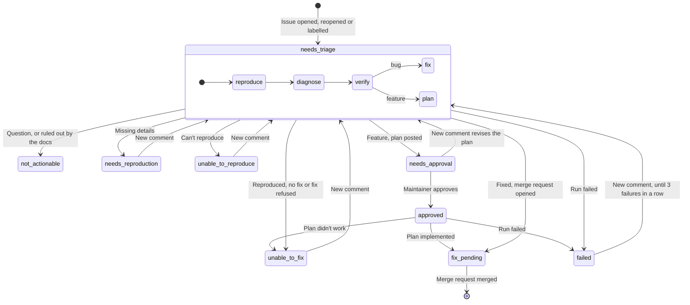

# gitlab-triagebot-action

AI issue triage for GitLab projects, run as a CI job. When a Reporter or above opens an issue, an agent reads the repository, reproduces what it can, decides whether the report is a bug, a feature or neither, and answers on the issue. It fixes what it can in a merge request that closes the issue. For a feature it posts a plan, and builds it only after a Maintainer approves.

The agent is [Flue](https://github.com/withastro/flue), as in upstream [withastro/triagebot-action](https://github.com/withastro/triagebot-action), so any model in its catalog works: setup is an API key, a model and a webhook. This fork is GitLab-only; use upstream for GitHub.

## How it works

The issue's `triage::…` label says where it stands, and the bot keeps exactly one. `not actionable` and `fix pending` are final. A fix is pushed as `triage/issue-<iid>` with a merge request that closes the issue, so it goes through the same pipeline and review as any other change. The issue stays on `triage::fix-pending` until the merge closes it or a later run replaces the label. Closing an issue closes its fix merge request and deletes the branch.


```mermaid
stateDiagram-v2
    [*] --> needs_triage: Issue opened, reopened or labelled

    needs_triage --> not_actionable: Question, or ruled out by the docs
    needs_triage --> needs_reproduction: Missing details
    needs_triage --> unable_to_reproduce: Can't reproduce
    needs_triage --> unable_to_fix: Reproduced, no fix or fix refused
    needs_triage --> fix_pending: Fixed, merge request opened
    needs_triage --> needs_approval: Feature, plan posted
    needs_triage --> failed: Run failed

    needs_approval --> approved: Maintainer approves
    needs_approval --> needs_triage: New comment revises the plan
    approved --> fix_pending: Plan implemented
    approved --> unable_to_fix: Plan didn't work
    approved --> failed: Run failed

    needs_reproduction --> needs_triage: New comment
    unable_to_reproduce --> needs_triage: New comment
    unable_to_fix --> needs_triage: New comment
    failed --> needs_triage: New comment, until 3 failures in a row

    fix_pending --> [*]: Merge request merged

    state needs_triage {
        direction LR
        [*] --> reproduce
        reproduce --> diagnose
        diagnose --> verify
        verify --> fix: bug
        verify --> plan: feature
    }
```

| Label | Meaning |
|-------|---------|
| `triage::needs-triage` | A run is queued or in progress |
| `triage::not-actionable` | A question, or ruled out by a documented decision. Final |
| `triage::needs-reproduction` | The report lacks what the agent needs to locate the problem |
| `triage::unable-to-reproduce` | The code doesn't behave as reported |
| `triage::unable-to-fix` | Diagnosed, but no fix it could defend, or the fix was refused |
| `triage::needs-approval` | A feature; the plan is posted and waits for a Maintainer |
| `triage::approved` | A Maintainer approved the plan; the run implementing it is queued |
| `triage::fix-pending` | Merge request open on `triage/issue-<iid>`. Final until merged |
| `triage::failed` | The run failed; the issue says why |

Comments retry the issue on every label except `not-actionable`, `approved` and `fix-pending`.

A run starts when:

- **A Reporter or above opens or reopens an issue**, unless it is opened already carrying a `triage::` label other than `triage::needs-triage`. Issue templates can set `triage::not-actionable` to opt out.
- **A Reporter or above adds `triage::needs-triage`.** This triages an existing issue, or runs one again after a final label.
- **A Maintainer swaps `triage::needs-approval` for `triage::approved`.** That run implements the bot's plan; see [Features](#features).
- **A Reporter or above comments on an issue labelled `needs triage`, `needs reproduction`, `unable to reproduce`, `unable to fix`, `needs approval` or `failed`.** The new run sees the conversation, so answering the bot's question is enough. Internal notes start no run. After three failed runs in a row, comments stop retrying; adding the label or reopening still does.

Only people with at least the Reporter role start a run, and never project or group bot users. Guests' issues wait until a Reporter adds the label, and Guests' comments are never read, so a Reporter restates a Guest's answer. Nothing the bot does itself starts a run. A run that fails, or whose agent hits its 22-minute limit, moves the issue to `triage::failed` and says so on the issue.

`scripts/triage-route.jq` decides from the webhook body what to do, `scripts/triage.sh` does it, and `prompt.md` is what the agent is told. The agent itself is `src/agent.ts`: the instructions and issue go in on stdin, and `{outcome, comment, commit_message}` comes out on stdout.

### Features

A feature is anything beyond the smallest change that makes the code do what its documentation says it does. The bot doesn't build one on its own. It posts a plan and labels the issue `triage::needs-approval`:

- **Slice:** one change, small enough for one merge request
- **Touches:** the files it will change, security-relevant changes first
- **Out of scope:** the rest of the feature, as follow-ups
- **Conflicts:** any documented decision it runs against

Comments from a Reporter or above revise the plan. A Maintainer swaps `triage::needs-approval` for `triage::approved` to have it built. That run gets the bot's last plan comment as its spec, not the issue description, which its author can still edit. It implements that slice and opens a merge request as for a fix, or ends on `unable to fix`. `triage.sh` enforces the approval, not the prompt. `approved` only counts when it replaces `needs-approval`, and only from a Maintainer; anyone else's goes back to `needs-approval`. An issue opened already carrying it is skipped, and `<issue>` or `<approved-plan>` tags in the issue text are defused.

To turn a feature down, close the issue or swap the label for `triage::not-actionable`.

## Setup

### 1. Include the job

```yaml
include:
  - remote: https://raw.githubusercontent.com/jakob1379/gitlab-triagebot-action/<commit>/triage.gitlab-ci.yml

triage:
  variables:
    TRIAGEBOT_REF: <commit>
```

The job fetches this repository at `TRIAGEBOT_REF`, builds the agent and runs it in your project's checkout. Pin both to the same commit.

Keep merge request pipelines off the bot's branches, and keep a new trigger pipeline from cancelling a running one:

```yaml
workflow:
  rules:
    - if: $CI_PIPELINE_SOURCE == "trigger"
      auto_cancel:
        on_new_commit: none
    - if: $CI_PIPELINE_SOURCE == "merge_request_event" && $CI_MERGE_REQUEST_SOURCE_BRANCH_NAME =~ /^triage\//
      when: never
    - when: always
```

Merge your own rules into this if you already have a `workflow:` block. Every issue event and comment starts a pipeline whose only job is `triage`, and most of those decide to skip.

### 2. Set the CI/CD variables

Scope the secrets to the `triage` environment, so no other job sees them:

| Variable | |
|----------|-|
| `TRIAGE_TOKEN` | Project access token, Developer role, `api` and `write_repository`. The bot comments and pushes as its bot user. |
| `TRIAGE_API_KEY` | API key for the model's provider. |
| `TRIAGE_MODEL` | `provider/model-id` from [pi-ai's catalog](https://github.com/earendil-works/pi/tree/main/packages/ai), such as `anthropic/claude-opus-4-8` or `openrouter/moonshotai/kimi-k2.6`. |
| `TRIAGE_THINKING` | Optional. Reasoning effort: `minimal`, `low`, `medium`, `high` (the default) or `xhigh`. |
| `TRIAGE_PROTECTED_PATHS` | Optional. Extended regex of paths a fix may not touch; the default is in `scripts/triage.sh`. |
| `CLOUDFLARE_ACCOUNT_ID` | Only for `cloudflare-workers-ai/*` models. |

GitLab creates the `triage::…` labels the first time the bot sets them. Scoped labels need GitLab Premium; on Free they are plain labels, and the bot still removes the old one when it sets a new one.

### 3. Create the trigger and webhook

A Maintainer creates them by hand, so the trigger token stays out of anything Developers can read. Anyone holding it can run any branch's pipeline as that Maintainer:

```bash
project=<project id>
token=$(glab api -X POST projects/$project/triggers -f description="Issue triage webhook" | jq -r .token)
glab api -X POST projects/$project/hooks -f name="Issue triage" \
  -f url="$CI_SERVER_URL/api/v4/projects/$project/ref/main/trigger/pipeline?token=$token" \
  -F push_events=false -F issues_events=true -F confidential_issues_events=true \
  -F note_events=true -F confidential_note_events=true >/dev/null
unset token
```

Replace `$CI_SERVER_URL` with your instance, such as `https://gitlab.com`, and `main` with your default branch. Then send a test issue event from Settings → Webhooks and check that a triage pipeline starts. To rotate the trigger, delete the old hook and trigger first; two live hooks start every run twice.

### 4. Tell the agent about your project

Flue loads `AGENTS.md` and the skills under `.agents/skills/` from the checkout, so that is where the project-specific part goes: how to build and test, what is deliberate, where decisions are written down. The prompt points the agent at the README and contributor docs as well. The agent has no package manager it can use as an unprivileged user, so it gets tools from Nix, pinned to your `flake.nix` when there is one.

## Security model

Whoever writes the issue can steer the agent, so the agent holds nothing that writes to GitLab:

- **No GitLab token.** The agent runs as its own user, `triage`, created in the job's container, with `env -i` and only the model's API key. It can't read the environment of `scripts/triage.sh`, which holds `TRIAGE_TOKEN`, or write `.git`. Every process it leaves behind is killed before the script uses the token. The agent can read its own API key, so use a key with a spend limit.
- **The script makes every write.** It is parsed in full before the agent starts, so editing it mid-run changes nothing. It refuses to publish anything containing a token verbatim, and fails the run if the agent changed `.git` config, hooks, refs or excludes.
- **Nothing runs before review.** It pushes with `ci.skip`, the workflow rule above blocks merge request pipelines for `triage/` branches, and it escapes quick actions and mentions in the agent's comment. A maintainer reads the diff, runs a pipeline for the branch under CI/CD → Pipelines → Run pipeline, and merges once it passes. If "Pipelines must succeed" is on, keep "Skipped pipelines are considered successful" off.
- **Tripwires, not a control.** A fix touching `TRIAGE_PROTECTED_PATHS` (by default CI config, agent instructions, `.envrc`, `flake.nix`/`flake.lock`, pre-commit config, `renovate.json`, `.git{attributes,ignore,modules}`), a binary file or an embedded repository is not pushed, and the issue ends on `unable to fix` with the agent's diagnosis. The control is the maintainer reading the diff: look hardest at access changes, at anything that runs during build or install (package scripts, build hooks), and at anything a developer's tooling loads on checkout.

The job's container reaches the internet. On a runner that can also reach internal networks, block job containers from them, or run triage on a runner that can't.

Concurrency is project-wide (`resource_group: triage`): the issue number is inside the payload file, which `resource_group` can't read. A comment posted while a run is in progress is read only if that run ends on a label that comments retry. GitLab.com creates at most 25 pipelines a minute per project, commit and user, and disables a webhook for a while after four failed deliveries, so a burst of comments can make it miss an issue; adding `triage::needs-triage` recovers it.

## Development

```bash
nix develop
pnpm install
pnpm test     # build, node tests, then scripts/test-triage{,-route}.sh against stub glab and agent
pnpm lint
```

`scripts/test-triage.sh` runs `scripts/triage.sh` end to end with stub `glab` and `node`, pushing to a local bare repository. Requires GitLab 16.11+, for `object_attributes.action` on note hooks.
